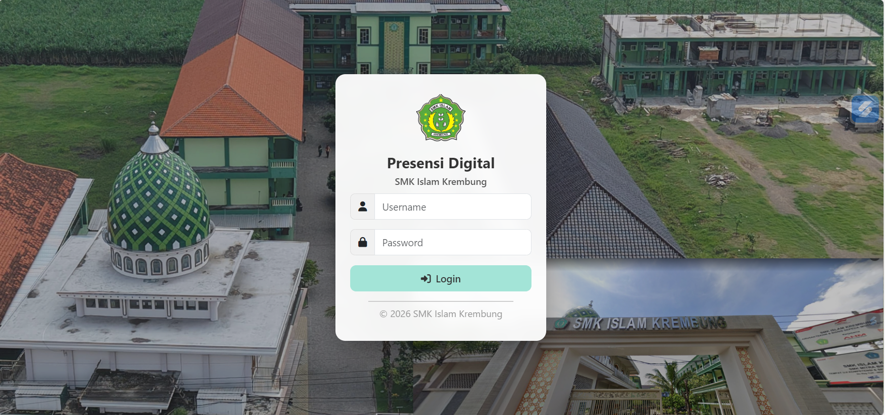
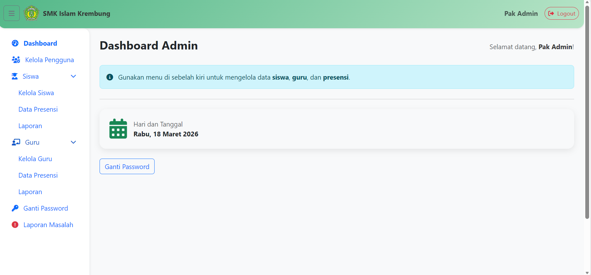
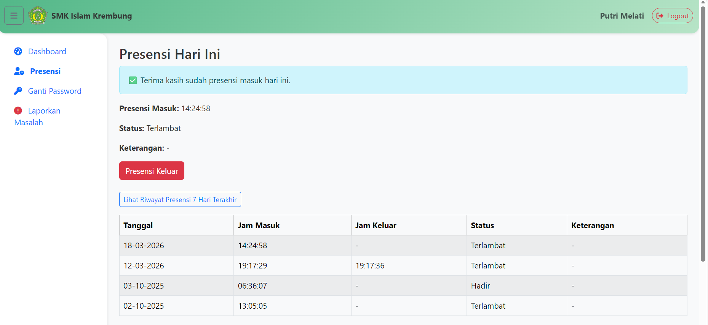
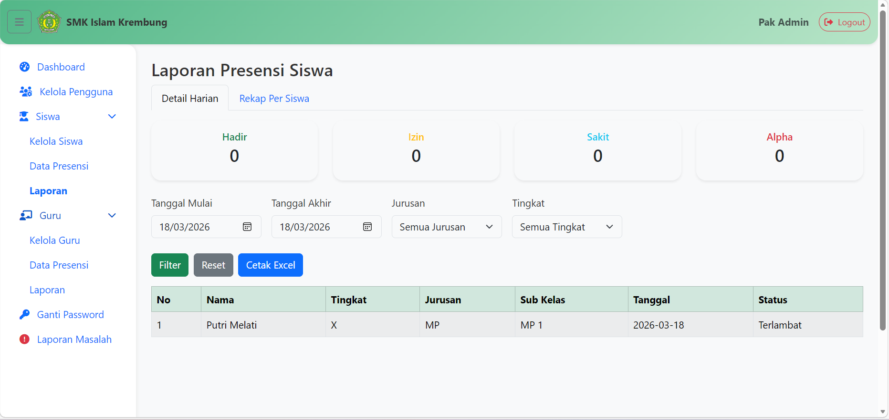

#  Sistem Presensi Digital — SMK Islam Krembung

Sistem presensi digital berbasis web untuk SMK Islam Krembung, dibangun menggunakan **Laravel**. Mendukung 4 role pengguna dengan alur yang berbeda-beda.

---
## 📸 Tampilan Sistem

  
  
  
  

  Login &nbsp;&nbsp; Dashboard &nbsp;&nbsp; Presensi &nbsp;&nbsp; Laporan

---
## 👥 Role Pengguna

| Role | Akses |
|------|-------|
| **Admin** | Kelola seluruh data siswa, guru, pengguna, presensi, dan laporan |
| **Siswa** | Presensi masuk & keluar harian |
| **Guru** | Isi presensi mengajar per jam ke |
| **Kiosk** | Terminal absen siswa tanpa login pribadi |

---

## 🔄 Alur Sistem

### 🔐 Login
Semua pengguna login melalui satu halaman. Setelah berhasil, sistem otomatis mengarahkan ke dashboard sesuai role masing-masing.

---

### 👨‍🎓 Alur Siswa
1. Login → masuk ke **Dashboard Siswa**
2. Klik menu **Presensi**
3. Pilih status kehadiran → klik **Presensi Masuk**
   - Jika jam masuk melebihi **07:00**, status otomatis berubah menjadi **Terlambat**
   - Jika memilih Izin / Sakit / Alpha → bisa isi keterangan
4. Saat pulang → klik **Presensi Keluar**
5. Riwayat presensi 7 hari terakhir bisa dilihat langsung di halaman yang sama

---

### 👨‍🏫 Alur Guru
1. Login → masuk ke **Dashboard Guru**
2. Klik menu **Isi Presensi**
3. Isi form: Jam Ke, Mata Pelajaran, Kelas, Jurusan, Sub Kelas
4. Sistem otomatis menentukan status berdasarkan jadwal:
   - **Senin–Kamis**: tersedia jam ke-1 sampai ke-9
   - **Jumat**: tersedia jam ke-1 sampai ke-7
   - Toleransi keterlambatan **10 menit** per jam
5. Riwayat presensi 7 hari terakhir tampil di halaman yang sama

---

### 🖥️ Alur Kiosk
1. Buka halaman kiosk (login dengan akun role kiosk)
2. Siswa ketik **username** lalu klik Absen
3. Sistem cek jam masuk → status otomatis Hadir / Terlambat
4. Cocok dipakai sebagai terminal absen di depan kelas / lobi

---

### 🛠️ Alur Admin

#### Kelola Data
- **Kelola Siswa** → tambah, edit, hapus data siswa. Filter berdasarkan jurusan, tingkat, sub kelas
- **Kelola Guru** → tambah, edit, hapus data guru beserta mata pelajaran yang diampu
- **Kelola Pengguna** → tambah, edit, hapus akun admin. Bisa import massal via file Excel

#### Data Presensi
- **Data Presensi Siswa** → lihat, edit, hapus, dan tambah manual presensi siswa per hari
- **Data Presensi Guru** → lihat, edit, hapus presensi guru. Filter berdasarkan tanggal, guru, kelas

#### Laporan & Export
- **Laporan Siswa** → rekap presensi siswa dengan filter tanggal, jurusan, tingkat, sub kelas. Bisa export ke **Excel**
- **Laporan Guru** → rekap presensi guru dengan filter lengkap. Bisa export ke **Excel**

#### Laporan Masalah
- Admin bisa melihat semua laporan masalah yang masuk dari siswa dan guru
- Bisa update status: **Belum Ditangani** → **Sedang Diproses** → **Selesai**
- Bisa kirim balasan langsung ke pelapor

---

### 🐛 Fitur Laporkan Masalah
Tersedia untuk semua role (admin, siswa, guru). Jika menemukan bug atau ingin memberi masukan:
1. Klik menu **Laporkan Masalah** di sidebar
2. Pilih kategori: Bug/Error, Tampilan, Saran Fitur, atau Lainnya
3. Isi judul dan deskripsi masalah → kirim
4. Bisa memantau status dan balasan dari admin di halaman yang sama

---

## 🗂️ Struktur Database

| Tabel | Keterangan |
|-------|-----------|
| `users` | Data semua pengguna (admin, siswa, guru, kiosk) |
| `presensi` | Data presensi harian siswa |
| `presensi_guru` | Data presensi mengajar guru |
| `jurusan` | Data jurusan (TKJ, MP, TP, TSM, TITL) |
| `kelas` | Data kelas per jurusan dan tingkat |
| `laporan_masalah` | Laporan bug / masukan dari pengguna |

---

## 🧰 Teknologi

- **Backend**: Laravel (PHP)
- **Frontend**: Bootstrap 5, Font Awesome
- **Database**: MySQL
- **Export Excel**: PhpSpreadsheet
